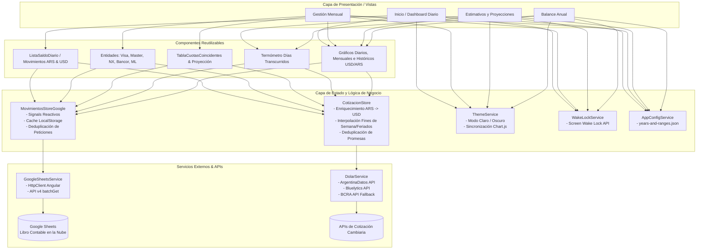
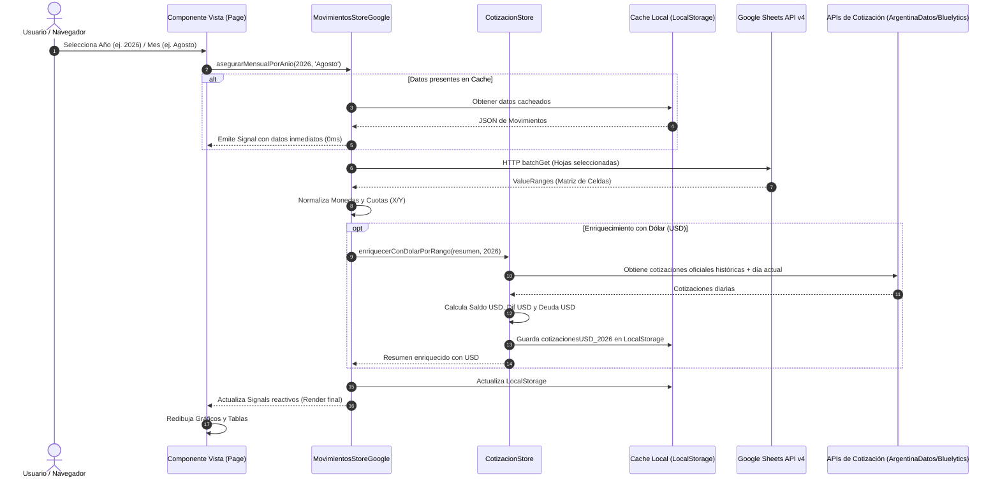
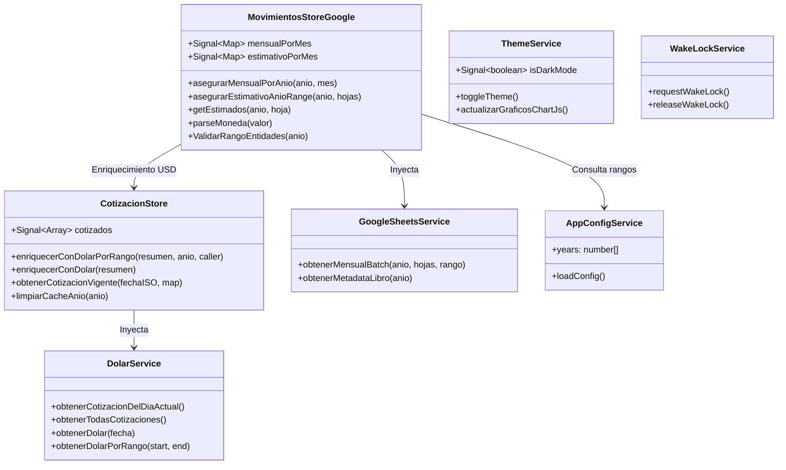

# 📊 Control de Gastos - DML (Frontend)

Sistema de gestión, análisis y proyección financiera personal y mensual de alto rendimiento desarrollado en **Angular 20 (Standalone Components + Signals)**, con **Angular Material 3**, **Chart.js**, integración bimonetaria en tiempo real (**ARS / USD Oficial y Blue**) y conexión directa a **Google Sheets API v4** como motor de base de datos en tiempo real sin backend intermediario.

---

## 📑 Tabla de Contenidos
1. [Arquitectura General](#-arquitectura-general)
2. [Flujo de Datos y Reactividad](#-flujo-de-datos-y-reactividad)
3. [Ecosistema Bimonetario y Módulo Dólar (USD)](#-ecosistema-bimonetario-y-módulo-dólar-usd)
   - [APIs Externas Utilizadas](#1-apis-externas-utilizadas)
   - [Servicios y Stores del Dólar (`DolarService` y `CotizacionStore`)](#2-servicios-y-stores-del-dólar-dolarservice-y-cotizacionstore)
   - [Algoritmo de Cotización Vigente e Interpolación](#3-algoritmo-de-cotización-vigente-e-interpolación)
   - [Estrategia de Caché y Deduplicación de Promesas](#4-estrategia-de-caché-y-deduplicación-de-promesas)
   - [Uso e Impacto en las Vistas](#5-uso-e-impacto-en-las-vistas)
4. [Estructura del Proyecto](#-estructura-del-proyecto)
5. [Módulos y Páginas](#-módulos-y-páginas)
   - [1. Dashboard de Inicio (`/inicio`)](#1-dashboard-de-inicio-inicio)
   - [2. Gestión Mensual (`/mensual`)](#2-gestión-mensual-mensual)
   - [3. Estimativos y Proyecciones (`/estimativo`)](#3-estimativos-y-proyecciones-estimativo)
   - [4. Balance Anual (`/anual`)](#4-balance-anual-anual)
6. [Capa de Estado y Servicios (Store Pattern)](#-capa-de-estado-y-servicios-store-pattern)
7. [Utilidades y Plugins Gráficos (Chart.js)](#-utilidades-y-plugins-gráficos-chartjs)
8. [Diseño y Sistema de Tokens (Modo Claro / Oscuro)](#-diseño-y-sistema-de-tokens-modo-claro--oscuro)
9. [Guía para Desarrolladores, QAs y Líderes Técnicos](#-guía-para-desarrolladores-qas-y-líderes-técnicos)

---

## 🏛 Arquitectura General

La aplicación sigue una arquitectura **Frontend Serverless Reactiva**:
- **Cero backend intermedio**: Se conecta de forma segura a Google Sheets API v4 mediante API Keys y consultas batch optimizadas.
- **Gestión de Estado Unidireccional con Signals**: La reactividad de Angular (`signal`, `computed`, `effect`) garantiza renderizados eficientes y sin sobrecarga de ciclos de detección.
- **Procesamiento Bimonetario Paralelo**: Conversión y enriquecimiento automático de saldos y deudas a USD usando cotizaciones históricas y del día.
- **Caché Multinivel**: Estrategia de hidratación inmediata desde memoria y `LocalStorage` con sincronización en segundo plano (*Stale-While-Revalidate*).



---

## 🔄 Flujo de Datos y Reactividad



---

## 💵 Ecosistema Bimonetario y Módulo Dólar (USD)

La aplicación incorpora un subsistema integral de procesamiento de divisas que convierte automáticamente los saldos y pasivos en pesos argentinos a dólares estadounidenses (**USD**), permitiendo analizar el patrimonio real sin la distorsión inflacionaria.

```mermaid
flowchart LR
    subgraph Fuentes_Dolar [APIs de Cotización]
        A1[ArgentinaDatos API\nCotizaciones Oficiales Históricas]
        A2[Bluelytics API\nCotización Oficial y Blue en Vivo]
        A3[BCRA API\nFallback Estadísticas Cambiarias]
    end

    subgraph Servicios_Dolar [Capa de Servicio y Store]
        DS[DolarService\n- HttpClient\n- Cache en Memoria\n- Manejo de Fallback]
        CS[CotizacionStore\n- enriquecerConDolarPorRango()\n- obtenerCotizacionVigente()\n- LocalStorage: cotizacionesUSD_YYYY]
    end

    subgraph Consumo_Vistas [Vistas y Componentes que consumen USD]
        U1[ListaSaldoDiario\nColumna Saldo USD y Dif USD]
        U2[MovimientosUSD\nGráficos Diarios USD]
        U3[GraficoMovimientosHistoricosUSD\nEvolución Multianual USD]
        U4[Estimativos\nSaldo Est. USD]
    end

    Fuentes_Dolar --> DS
    DS --> CS
    CS --> Consumo_Vistas
```

### 1. APIs Externas Utilizadas
El servicio [`DolarService`](file:///c:/David/Proyectos/Control_Gastos/Front_Control_Gastos/control-gastos-front/src/app/services/dolar.service.ts) consulta múltiples proveedores con arquitectura de tolerancia a fallos:

1. **`ArgentinaDatos API`** (`https://api.argentinadatos.com/v1/cotizaciones/dolares/oficial`):
   - **Proveedor principal para datos históricos**.
   - Permite descargar la serie completa o filtrar por día (`/oficial/{YYYY}/{MM}/{DD}`).
2. **`Bluelytics API`** (`https://api.bluelytics.com.ar/v2/latest`):
   - **Cotización en tiempo real del día en curso**.
   - Provee valores de compra, venta y promedio para **Dólar Oficial** y **Dólar Blue** (`value_sell`, `value_buy`, `value_avg`).
3. **`Banco Central de la República Argentina (BCRA API)`** (`https://api.bcra.gob.ar/estadisticascambiarias/v1.0/Cotizaciones/USD`):
   - **Proveedor de respaldo (Fallback)** si la API principal se encuentra fuera de servicio.

---

### 2. Servicios y Stores del Dólar (`DolarService` y `CotizacionStore`)

- **`DolarService`** ([`src/app/services/dolar.service.ts`](file:///c:/David/Proyectos/Control_Gastos/Front_Control_Gastos/control-gastos-front/src/app/services/dolar.service.ts)):
  - Singleton inyectable (`providedIn: 'root'`).
  - Mantiene `cacheTodasCotizaciones` en memoria y una promesa en vuelo (`promesaCotizaciones`) para que múltiples llamadas simultáneas compartan una única petición HTTP.
  - Guarda cada cotización por fecha individual en `localStorage.getItem('dolar_YYYY-MM-DD')`.

- **`CotizacionStore`** ([`src/app/stores/dolar.store.ts`](file:///c:/David/Proyectos/Control_Gastos/Front_Control_Gastos/control-gastos-front/src/app/stores/dolar.store.ts)):
  - Store reactivo con Signal `cotizados`.
  - Procesa listas de movimientos en pesos y calcula:
    $$\text{totalUSD} = \frac{\text{totalARS}}{\text{tipoCambioVenta}}$$
    $$\text{diferenciaUSD} = \text{totalUSD}_{\text{hoy}} - \text{totalUSD}_{\text{ayer}}$$
    $$\text{deudaUSD} = \frac{\text{deudaPesos}}{\text{tipoCambioVenta}}$$

---

### 3. Algoritmo de Cotización Vigente e Interpolación
En fines de semana, feriados bancarios o días sin cotización oficial, el método `obtenerCotizacionVigente(fechaISO, cotizacionesMap)` aplica una estrategia de 4 niveles:
1. **Búsqueda Exacta**: Si existe cotización para la fecha indicada, la utiliza inmediatamente.
2. **Búsqueda Retroactiva (Hacia Atrás hasta 365 días)**: Si la fecha es fin de semana (sábado/domingo) o feriado, retrocede día por día buscando la última cotización oficial de cierre hábil previa.
3. **Cotización Más Reciente**: Para fechas futuras o proyecciones, aplica la cotización válida más reciente registrada.
4. **Respaldo de Emergencia**: Si el mapa está incompleto, recupera el último valor positivo registrado en el histórico.

---

### 4. Estrategia de Caché y Deduplicación de Promesas
- **Persistencia por Año**: Al procesar un año completo, almacena el mapa de cotizaciones en `localStorage` bajo la clave `cotizacionesUSD_${anio}`.
- **Hash de Validación**: Utiliza `resumenHash` para verificar si los movimientos en pesos sufrieron modificaciones antes de recalcular la serie de dólares.
- **Deduplicación en Vuelo (`enProcesoPromesas`)**: Si componentes hermanos (como `ListaSaldoDiario`, `MovimientosUSD` y `GraficoMovimientosHistoricosUSD`) solicitan enriquecimiento al mismo tiempo, todos aguardan la misma promesa en ejecución, evitando cálculos y bloqueos innecesarios.

---

### 5. Uso e Impacto en las Vistas
- **Dashboard de Inicio**:
  - `ListaSaldoDiario`: Columna `USD` con el saldo diario convertido y badges de variación en dólares.
  - `MovimientosUSD`: Gráfico de barras de evolución del saldo diario en USD.
  - `GraficoMovimientosHistoricosUSD`: Gráfico histórico continuo del patrimonio neto valuado en dólares oficiales a lo largo de los años.
- **Módulo Estimativos**:
  - `EstimativoMensual`: Columna `Saldo Est. USD` que muestra la proyección en dólares según el tipo de cambio del mes.

---

## 📁 Estructura del Proyecto

```
src/
├── app/
│   ├── models/                   # Interfaces TypeScript tipadas
│   │   ├── entidad.ts            # Modelo unificado de fila financiera
│   │   └── cotizacion.ts         # Modelo de tipo de cambio y registros USD
│   ├── pages/                    # Vistas principales de la aplicación
│   │   ├── inicio/               # Dashboard de Saldo Diario y Gráficos Históricos
│   │   │   ├── lista-saldo-diario/ # Tabla interactiva con saldos ARS y USD
│   │   │   ├── movimientos/      # Gráfico de barras ARS
│   │   │   ├── movimientos-usd/  # Gráfico de barras USD
│   │   │   └── graficos/         # Gráficos históricos multianuales (ARS y USD)
│   │   ├── mensual/              # Gestión de Entidades, Cuotas y Proyecciones
│   │   │   ├── lista-entidades/  # Visa, Master Galicia, Naranja, Bancor, ML, Otros
│   │   │   ├── cuotas-coincidentes/ # Subtotales por planes de cuotas (X/Y)
│   │   │   ├── proyeccion-totales/  # Proyección de todos los meses del año
│   │   │   ├── resumen/          # Tabla matricial cruzada
│   │   │   └── graficos-entidades/
│   │   ├── estimativos/          # Proyección Diaria vs Real y Regresión Lineal
│   │   │   ├── mensual/          # Tabla estimativo diario
│   │   │   ├── grafico-estimativo/ # Curva real vs estimada con tendencias
│   │   │   ├── grafico-historico/ # Serie histórica consolidada
│   │   │   └── grafico-dias-restantes-estimativo/
│   │   └── anual/                # Matriz Anual Consolidada y Termómetro
│   │       ├── tabla-resumen-anual/ # Matriz 12 meses x entidades
│   │       ├── grafico-resumen-anual/
│   │       └── grafico-dias-restantes-anual/ # Termómetro 365/366 días
│   ├── services/                 # Servicios transversales singleton
│   │   ├── google.sheets.service.ts # Cliente HTTP Google Sheets API v4
│   │   ├── dolar.service.ts      # Cliente HTTP para APIs de Dólar (ArgentinaDatos/Bluelytics/BCRA)
│   │   ├── theme.service.ts      # Gestión de Modo Claro/Oscuro y sincronización Chart.js
│   │   ├── wake-lock.service.ts  # Control de suspensión de pantalla (Screen Wake Lock API)
│   │   └── app-config.service.ts # Carga de rangos y años configurables
│   ├── stores/                   # Manejo de estado global reactivo (Store Pattern)
│   │   ├── movimiento.google.ts  # Store principal de Google Sheets con Signals y Caché
│   │   └── dolar.store.ts        # Store de cotizaciones y enriquecimiento USD
│   └── utils/                    # Funciones matemáticas y plugins de Chart.js
│       └── grafico.utils.ts      # Regresión lineal, badges de año y colores HSL
├── assets/
│   ├── logos/                    # Emblemas oficiales (Visa, NX, Bancor, MP, Master)
│   ├── years-and-ranges.json     # Mapeo de celdas, hojas y colores por entidad
│   └── feriados.json             # Calendario oficial de feriados nacionales
└── styles.scss                   # Tokens CSS globales, temas y layout
```

---

## 🖥 Módulos y Páginas

### 1. Dashboard de Inicio (`/inicio`)
*Objetivo*: Brindar una vista panorámica diaria de los ingresos, egresos, saldos en pesos, cotización del dólar y deuda consolidada.

*Componentes destacados*:
- **`Selector de Años Responsivo`**: En desktop utiliza `mat-stepper` horizontal y en dispositivos móviles una barra flotante de *Year Pills* de fácil acceso táctil.
- **`ListaSaldoDiario`**: Tabla interactiva con paginación que calcula diferencias diarias en ARS y USD, saldo acumulado y resalta automáticamente fines de semana y feriados según [`feriados.json`](file:///c:/David/Proyectos/Control_Gastos/Front_Control_Gastos/control-gastos-front/src/assets/feriados.json).
- **`Movimientos` y `MovimientosUSD`**: Gráficos de barras que reflejan la variación día por día.
- **`GraficoMovimientosHistoricos` y `GraficoMovimientosHistoricosUSD`**: Gráficos multianuales continuos con el plugin de divisiones por año (`yearBackgroundPlugin`), líneas punteadas y badges superiores para rápida identificación cronológica.

---

### 2. Gestión Mensual (`/mensual`)
*Objetivo*: Control detallado de las tarjetas de crédito y medios de pago, segmentación de cuotas y proyección de compromisos futuros.

*Componentes destacados*:
- **Tarjetas de Entidades Financieras**:
  - `Visa` (Galicia Platinum), `Mastercard Galicia`, `Naranja X`, `Bancor`, `Mercado Pago / Mercado Libre` y `Otros`.
  - Cada tarjeta cuenta con su logo oficial alineado a la izquierda, título centrado, botón colapsable animado, etiquetas de estado (`[NUEVO!]` para cuota 1/X y `[¡ULTIMA!]` para cuota X/X) y cálculo automático de subtotales.
- **`TablaCuotasCoincidentes`**: Agrupa y suma todos los consumos que comparten el mismo esquema de cuotas (ej. `Cuota 2/6`, `Cuota 3/12`), permitiendo conocer exactamente cuánto peso tiene cada plan de financiación.
- **`TablaProyeccionTotales`**:
  - Matriz con **todos los meses del año** (`Enero` a `Diciembre` + meses extendidos).
  - Identificación visual: **Meses Pasados** (verde suave), **Mes Seleccionado / Actual** (etiqueta `ACTUAL` destacada en ámbar) y **Meses Futuros** con la proyección de gastos comprometidos.
- **`GraficosEntidades`**: Comparativas visuales por tarjeta y evolución histórica mensual.

---

### 3. Estimativos y Proyecciones (`/estimativo`)
*Objetivo*: Seguimiento presupuestario diario contra los gastos reales cargados, midiendo la desviación respecto al saldo estimado y la deuda.

*Componentes destacados*:
- **`GraficoDiasRestantesAnual` (Termómetro de Progreso)**:
  - Barra de avance visual que se llena dinámicamente según el día del mes o año.
  - Color adaptativo en escala HSL (0% Rojo $\rightarrow$ 50% Amarillo $\rightarrow$ 100% Verde brillante).
  - Animación con curva `cubic-bezier(0.22, 1, 0.36, 1)` de 1.3s y aceleración a 400ms en cambios rápidos de mes.
- **`EstimativoMensual`**: Tabla de control diario con cálculo de diferencia real vs proyectada y saldo estimado en dólares.
- **`GraficoEstimativo`**: Gráfico de líneas con cálculo de regresión lineal por mínimos cuadrados para estimar la **Tendencia Real** y la **Tendencia de Deuda**, resaltando los puntos de máxima y mínima desviación con indicadores visuales.
- **`Auto-refresco Inteligente`**: Polling focalizado cada 12 segundos sobre la hoja del mes activo sin re-descargar históricos, protegiendo la aplicación de bloqueos por cuota de Google Sheets API (`HTTP 429`).

---

### 4. Balance Anual (`/anual`)
*Objetivo*: Consolidación global de los 12 meses del año en una única vista ejecutiva.

*Componentes destacados*:
- **`TablaResumenAnual`**: Matriz completa que totaliza cada una de las entidades mes por mes con fila de totales acumulados.
- **`GraficoResumenAnual`**: Gráfico comparativo de barras apiladas y líneas de evolución anual.
- **`Termómetro Anual`**: Indicador del total de días transcurridos sobre los 365 o 366 días (con soporte de años bisiestos).

---

## 📦 Capa de Estado y Servicios (Store Pattern)



### Principios de Robustez en los Stores:
1. **Deduplicación de Peticiones Asíncronas**: Si dos componentes solicitan la misma hoja o el mismo rango de cotizaciones en paralelo, comparten la misma promesa de carga en vuelo (`estimativoEnCarga` / `enProcesoPromesas`), evitando peticiones HTTP redundantes.
2. **Normalización Robusta de Moneda**: Limpieza de separadores de miles y decimales de formato latinoamericano (`$ 1.234.567,89` $\rightarrow$ `1234567.89`).
3. **Resiliencia de Red**: Almacenamiento local para permitir navegación offline o instantánea mientras se sincronizan los datos de Google Sheets y de las APIs de cotizaciones.

---

## 📈 Utilidades y Plugins Gráficos (Chart.js)

En [`grafico.utils.ts`](file:///c:/David/Proyectos/Control_Gastos/Front_Control_Gastos/control-gastos-front/src/app/utils/grafico.utils.ts) se encuentran extensiones y plugins personalizados de **Chart.js**:

### 1. Plugin de Fondos y Separadores Anuales (`yearBackgroundPlugin`)
- Dibuja divisiones verticales punteadas entre años en el Canvas 2D.
- Aplica sombreados suaves y alternados a años anteriores para contrastar con el año actual.
- **Badges Flotantes de Año**: Inserta una cápsula redondeada translúcida con el texto del año (`2023`, `2024`, `2025`, `2026`) en la parte superior de cada división, optimizando la lectura en pantallas táctiles y móviles.

### 2. Algoritmo de Regresión Lineal (`calcularTendencia`)
Calcula la pendiente ($m$) y la ordenada al origen ($b$) descartando valores nulos para trazar líneas de tendencia predictivas:
$$m = \frac{n \sum(xy) - \sum x \sum y}{n \sum(x^2) - (\sum x)^2}, \quad b = \frac{\sum y - m \sum x}{n}$$

---

## 🎨 Diseño y Sistema de Tokens (Modo Claro / Oscuro)

El diseño visual cumple con altos estándares de estética moderna (Glassmorphism sutil, bordes pulidos `12px`, sombras suaves `0 4px 12px rgba(0,0,0,0.05)` y micro-animaciones).

### Diccionario Central de Tokens CSS ([`styles.scss`](file:///c:/David/Proyectos/Control_Gastos/Front_Control_Gastos/control-gastos-front/src/styles.scss)):
```scss
:root {
  --bg-app: #f8fafc;
  --bg-surface: #ffffff;
  --bg-card: #ffffff;
  --bg-card-header: #f1f5f9;
  --border-card: #e2e8f0;
  --text-primary: #1e293b;
  --text-secondary: #64748b;
  --table-header-bg: #768699;
}

body.dark-mode {
  --bg-app: #0f172a;
  --bg-surface: #1e293b;
  --bg-card: #1e293b;
  --bg-card-header: #334155;
  --border-card: #334155;
  --text-primary: #f8fafc;
  --text-secondary: #cbd5e1;
  --table-header-bg: #0f172a;
}
```

---

## 🛠 Guía para Desarrolladores, QAs y Líderes Técnicos

### 1. Requisitos Previos
- **Node.js**: `v20.x` o superior.
- **npm** / **pnpm**: `pnpm` o `npm`.
- **Angular CLI**: `20.2.x`.

### 2. Comandos de Ejecución
```bash
# Instalar dependencias
npm install

# Servidor de desarrollo local
npm run start
# o
npx ng serve

# Compilación para Producción
npx ng build --configuration production

# Verificación de Tipos y Compilación Development
npx ng build --configuration development
```

### 3. Matriz de Pruebas y Validación (QA Checklist)
- [x] **Conversión de Divisas (ARS / USD)**: Verificar que los valores en dólares en `ListaSaldoDiario`, `MovimientosUSD` y `GraficoMovimientosHistoricosUSD` coincidan con la división exacta por el tipo de cambio oficial del día.
- [x] **Interpolación de Dólar en Feriados / Fines de Semana**: Comprobar que en días no hábiles se aplique la cotización de cierre hábil previa sin mostrar valores `0` ni `NaN`.
- [x] **Caché y Tolerancia a Fallos Cambiarios**: Desconectar la red tras la primera carga y comprobar que las cotizaciones persistan desde `localStorage.getItem('cotizacionesUSD_YYYY')`.
- [x] **Navegación entre Años y Meses**: Verificar que el cambio de año cargue las hojas correspondientes sin mezclar datos de años anteriores.
- [x] **Consistencia de Proyección Futura**: Comprobar que en `/mensual` la tabla de *Proyección de Totales Futuros* mantenga visibles todos los meses del año sin recortar los meses anteriores.
- [x] **Sincronización en Tiempo Real en Estimativos**: Editar un valor en Google Sheets (ej. columna `Real`), esperar el ciclo de 12s y verificar que tanto la tabla como el gráfico se actualicen sin requerir recarga manual (`F5`).
- [x] **Modo Claro / Modo Oscuro**: Alternar el tema desde el botón de la barra superior y comprobar que los textos de los ejes de todos los gráficos adapten su contraste inmediatamente.
- [x] **Responsividad Mobile**: Probar en anchos $\le 768\text{px}$ que las tablas cuenten con scroll horizontal y los selectores de año se conviertan en botones tipo *pill*.
